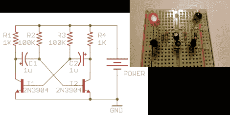

# 理论和实践中的多谐振荡器

> 原文：<https://hackaday.com/2011/12/01/multivibrator-in-theory-and-practice/>

我们必须承认，过去我们曾使用微控制器让两个发光二极管交替闪烁。这不是最糟糕的越轨行为，但它源于我们对模拟电路的不适。幸运的是，[Ray]出版了关于构建多谐振荡器电路的图解指南。这是组装双输出振荡器的简单方法。它只需要一对 NPN 晶体管，然后根据电阻电容(RC)定时器来开关。

[Ray]很好地向我们介绍了电路在一个完整周期的每个阶段是如何工作的。你需要仔细阅读，但他用来淡化各种电气状态快照的补充示意图确实有助于我们理解。

当然，闪烁的发光二极管并不是多谐振荡器的唯一目的。这是一种产生干净方波的方法，该方波[可用作 TTL 逻辑芯片](http://hackaday.com/2010/03/16/pure-ttl-based-clock/)的时钟信号。哦，我们在开谁的玩笑，休息后看看视频中你自己的闪光点吧。

 <https://www.youtube.com/embed/u9eAKk6jo2s?version=3&rel=1&showsearch=0&showinfo=1&iv_load_policy=1&fs=1&hl=en-US&autohide=2&wmode=transparent>

 <iframe class="youtube-player" width="800" height="480" src="https://www.youtube.com/embed/Rf2fAsSs7nk?version=3&amp;rel=1&amp;showsearch=0&amp;showinfo=1&amp;iv_load_policy=1&amp;fs=1&amp;hl=en-US&amp;autohide=2&amp;wmode=transparent" allowfullscreen="true" style="border:0;" sandbox="allow-scripts allow-same-origin allow-popups allow-presentation"/> </body> </html>