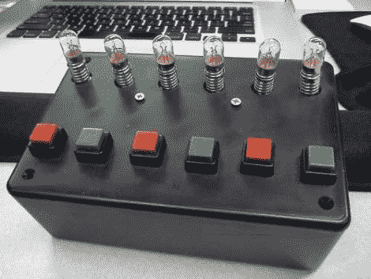

# 儿童发光玩具是一个简单的手工制作的礼物

> 原文：<https://hackaday.com/2011/12/02/childrens-light-up-toy-is-an-easy-hand-made-gift/>

虽然今年的圣诞清单主要是电子产品和其他大规模生产的玩具，但情况并不总是这样。我们不想让自己听起来像一个对邻居的孩子大喊大叫的老人，让他们离开自己的草坪，但是今天的许多礼物都缺乏老式手工玩具中的个人风格。

[henlij 的]儿子是一个初露头角的电子极客，他喜欢玩开关和灯，所以他受到[的启发，为他制作了一个有趣的玩具](http://www.instructables.com/id/Light-and-Switch-Toy-for-Child-6-bulbs-6-switche/?ALLSTEPS)来打发时间。他做了一个简单的盒子，里面装满了灯和开关，他的儿子可以随心所欲地开关。

虽然盒子里没有太多东西，但我们认为这个想法很棒。只需几美元的简单组件，任何熟悉焊接站的人都可以制作出让孩子着迷几个小时的东西。

也没有理由停留在按钮和灯上。如果我们要建造一个，我们会把灯泡换成发光二极管，然后加上各种各样的开关和转盘，以及扬声器和任何其他我们能拿到的部件。

选择是无限的，所以如果你碰巧认识一个喜欢玩按钮和开关的孩子，为什么不在今年给他或她做些特别的东西，就像[henlij]为他儿子做的那样？