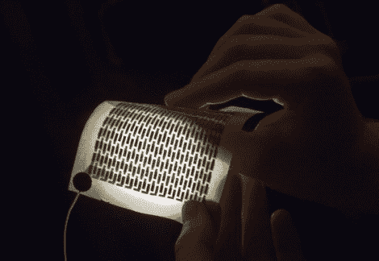

# 不用时可以折叠起来的可印刷太阳能电池

> 原文：<https://hackaday.com/2011/12/02/printable-solar-cells-that-can-be-folded-up-when-not-in-use/>

这是一种可以印在纸上的光伏电池。制造技术几乎和使用喷墨打印机一样简单。秘密就在墨水本身。它需要在真空室中在纸上沉积五层。但这比目前的太阳能电池制造实践要容易得多。事实上，这听起来像是印刷过程非常类似于薯片袋的制作过程。这一点意义重大，因为这意味着该技术可以快速进入大规模生产。

让我们兴奋的不仅仅是简单的印刷过程。休息后，请观看视频，其中测试电池被放置在光源上方，同时受到万用表的监控。它像扇子一样被折叠起来，你可以看到一名研究人员将电池折叠成一个小的形状用于储存。这有点违背直觉；例如，你不会想用它做一个窗帘，因为它必须在白天放下来获取能量。我们认为这些可折叠的特性会有很大的用处。[https://www.youtube.com/embed/21O0tBe-Alk?version=3&rel=1&showsearch=0&showinfo=1&iv_load_policy=1&fs=1&hl=en-US&autohide=2&wmode=transparent](https://www.youtube.com/embed/21O0tBe-Alk?version=3&rel=1&showsearch=0&showinfo=1&iv_load_policy=1&fs=1&hl=en-US&autohide=2&wmode=transparent)

[谢谢罗伯]