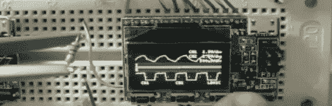
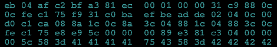

# 黑客日链接:2011 年 12 月 3 日

> 原文：<https://hackaday.com/2011/12/03/hackaday-links-december-3-2011/>

#### 亲爱的，你想要一些奶酪吗？呼呼

[提米]弄坏了他的手动奶酪刨丝器。扔掉一个功能完善的工具只是少了一个手柄是一种浪费，所以他用无绳电钻把它提高了一个档次。现在[蒂姆]，"可以以令人难以置信的速度和力量磨碎即使是最坚硬的奶酪。"谁有破胡椒磨？

#### 最可爱的示波器

我们不太喜欢插产品，但是这个范围真的很酷。它是为安装在试验板上而设计的，比我们见过的一些 IC 要小(68000，所以是的)。我们想知道为什么还没有自制的版本。

#### 现在做一个遥控城堡

这里有一辆由[brickmodder]制造的[迷你图大小的遥控乐高汽车](http://www.youtube.com/watch?feature=player_embedded&v=Ae_sQO5fqsQ#!)。它有一个定制的传动系统和转向机构，使用了[brickmodder]能找到的最小的伺服系统。接下来来一艘遥控海盗船怎么样？

#### 可能是某个东西的广告

这里有一些代码询问这个问题，“你能破解它吗？”显然，这是为了[英国密码分析师招募](http://abcnews.go.com/blogs/technology/2011/12/can-you-crack-it-uk-agencys-website-seeks-new-spies/)。你不会得到 00-指定，但*拉拢*布莱奇利公园。

#### 反转逆变器

[曼弗雷德]正在他的土地上安装替代能源。当然，他需要一个逆变器来给电池充电，所以他带了一个备受推崇的(高价)盒子。他得到的是[而不是](http://ludens.cl/Electron/chinverter/chinverter.html)。你至少需要 10 分钟的时间来完成这个高质量台湾逆变器的滑稽悲伤的拆卸过程。哦，[曼弗雷德]太棒了。看看他的[微型水电站](http://ludens.cl/paradise/turbine/turbine.html)就知道了。