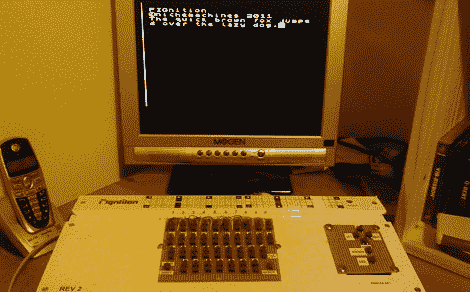

# 一个供你配置的键盘

> 原文：<https://hackaday.com/2011/12/04/a-keyboard-for-your-fignition/>

[卡尔]送来了他为他的微型计算机制作的键盘。至少现在他的按键已经超过 8 个了。

[图](https://sites.google.com/site/libby8dev/fignition)是一台微型计算机，可以追溯到 8 位时代。FIGnition 被设计成一台像[牵牛星](http://www.old-computers.com/museum/computer.asp?st=1&c=62)或[希斯基特](http://www.old-computers.com/museum/computer.asp?st=1&c=134)(没有闪光灯)一样的教育计算机，它让学生“裸机”访问系统中的一切。它由 ATMega168、4 Kb SRAM 和 8Mb 闪存芯片提供存储。不幸的是，这个图形只有 8 个按钮可以编程，所以[Carl]的项目在社区中非常受欢迎。

为了将 8 个按钮扩展成一个字母数字键盘，[Carl]想出了每个字符使用两个轻触开关的解决方案。这些开关具有不同的按钮高度，因此按下一对按钮会按顺序启动两个按钮，这是图中固有的解释。这和图中的和弦琴键是完美的搭配。

看看休息后[Carl]捆电线的视频。

[https://www.youtube.com/embed/Hz6BSqYn8uc?version=3&rel=1&showsearch=0&showinfo=1&iv_load_policy=1&fs=1&hl=en-US&autohide=2&wmode=transparent](https://www.youtube.com/embed/Hz6BSqYn8uc?version=3&rel=1&showsearch=0&showinfo=1&iv_load_policy=1&fs=1&hl=en-US&autohide=2&wmode=transparent)