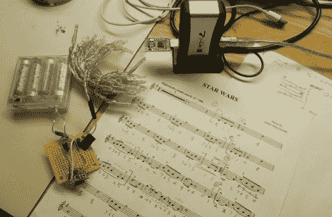

# 这个圣诞树灯光秀的原力很强

> 原文：<https://hackaday.com/2011/12/05/the-force-is-strong-with-this-christmas-tree-light-show/>

[扎克]是《星球大战》的超级粉丝，除了装饰他房子的节日装饰品外，他说他的妻子很好，让他挂上了一棵装满《星球大战》装饰品的圣诞树。在过去的几年里，这棵树一直放在房间的角落里，没有亮灯，但他的妻子认为今年应该会有一些灯。

他的妻子带着一串电池供电的灯回家，但[扎克]想要更有一点极客信誉的东西。他决定对灯光进行编程，播放《星球大战》主题曲，将曲调的音高转换成光的强度。

他翻遍了他的电子产品箱，找到了一个 MSP430 和一个小型目标板，可以很好地完成这项工作。他坐下来看了一些活页乐谱，将音符转换成 PWM 值，产生了你在下面看到的灯光表演。

虽然他的妻子为圣诞树提供了可爱的小提琴伴奏，但我们认为一个小的音频模块将为明年的圣诞树增添一大亮点。

 <https://www.youtube.com/embed/cDE_yXY7pxo?version=3&rel=1&showsearch=0&showinfo=1&iv_load_policy=1&fs=1&hl=en-US&autohide=2&wmode=transparent>

 </body> </html>