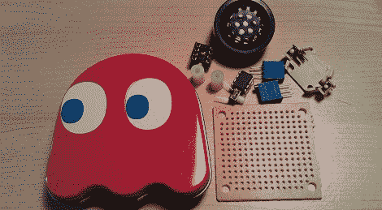

# 音乐糖果罐

> 原文：<https://hackaday.com/2011/12/05/musical-blinky-candy-tin/>

因为现在是假期，世界各地的松树都被砍伐并被安装在客厅里，[Jarv]尽管制作一个[音乐圣诞装饰品](http://jarv.org/2011/12/musical-ms-pacman-candy-tin-hack/)是个好主意。他需要保留一些他的极客信誉，所以[Jarv]决定用 Pacman 制作一个音乐[Blinky]幽灵。

几周前，[Jarv]寄出了他的[音乐贺卡](http://hackaday.com/2011/11/22/musical-greeting-card-with-minimal-parts/)，它使用最少的部件来演奏一首短短的 8 位曲子。他的项目是基于 85 年代的，听起来[很不错](http://www.youtube.com/watch?feature=player_embedded&v=gntKQZFomi8)。对于他的[Blinky]装饰品，[Jarv]使用了类似的电路以及一些听起来很棒的老派 Pacman 歌曲。

[Jarv]找到了一个[Blinky]糖果罐，在扔掉所有的榨好的糖之后，他开始着手建造。为了与他的贺卡保持一致，一切都非常简单。只有一个扬声器，ATtiny85，和按钮组成的建设。按下按钮会循环播放 Pacman 女士的三首歌曲。结果听起来不可思议地像一个老式的街机游戏，所以请务必在休息后查看视频。

[https://www.youtube.com/embed/hyWlVr72n1M?version=3&rel=1&showsearch=0&showinfo=1&iv_load_policy=1&fs=1&hl=en-US&autohide=2&wmode=transparent](https://www.youtube.com/embed/hyWlVr72n1M?version=3&rel=1&showsearch=0&showinfo=1&iv_load_policy=1&fs=1&hl=en-US&autohide=2&wmode=transparent)