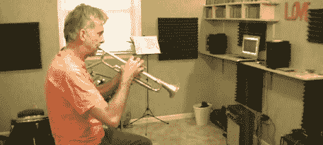

# 声音处理工作室

> 原文：<https://hackaday.com/2011/12/06/sound-treating-a-studio/>

看来[迪诺]要让乐队重新团结起来了。在一个垃圾场电子管放大器和 DIY 颤音踏脚转盘之后，他再次回来，这次在他的工作室做了一点[声音处理。](http://hackaweek.com/hacks/?p=447)

大多数房间自然有一点飘动的回声。当你搬进公寓或新房子时，你会注意到这一点——没有地毯、窗帘和家具，房间听起来更宽敞。不幸的是，尽管 MTV 婴儿床可能告诉了我们什么，但拥有一堆沙发对工作室的工作流程来说并不是好兆头。通常的解决方法是在墙上贴一些吸音材料，一公吨的纸板鸡蛋盒是不行的。

[迪诺]发现了一堆他邻居在装修时扔掉的隔音板(是的，我们知道，他很幸运)。做了一些安装前的测试后，面板就挂了。之后，回声量急剧减少。

好消息是，我们终于可以看一看[迪诺]的工作室了。我们看到了前面提到的[废车场电子管放大器](http://hackaday.com/2011/11/21/junkyard-tube-amp-gold/)，但没有看到他制作的[整齐的颤音踏板](http://hackaday.com/2011/11/29/fabbing-a-guitar-tremolo-stompbox/)。

休息之后，看看[Dino]的声音处理房间的视频。

 <https://www.youtube.com/embed/xsZUctSSDDc?version=3&rel=1&showsearch=0&showinfo=1&iv_load_policy=1&fs=1&hl=en-US&autohide=2&wmode=transparent>

 </body> </html>