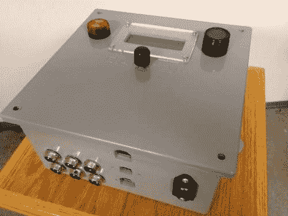

# 作为项目外壳的室外级电箱

> 原文：<https://hackaday.com/2011/12/06/exterior-grade-electrical-box-as-project-enclosure/>

对项目盒的追求总是在成本、复杂性和风格之间取得平衡。我们认为[Pcmofo]真的找到了他的外部电气盒外壳的标志。他花时间[记录他的制作过程](http://www.instructables.com/id/Building-an-Electronics-Enclosure/)给那些想要复制他的样子的人。

这些灰色塑料盒是为了让这些元素远离家用和商用电气系统。它们很容易找到，有许多不同的尺寸(这个是 8 英寸见方，4 英寸深)。这种塑料非常坚硬，但仍然很容易用简单的工具加工。

[Pcmofo]从目测其组件的位置开始。一旦他有了每个应该放在哪里的好主意，他就抓起测径器，用 Adobe Illustrator 或 Inkscape 设计一个模板。这是附有油漆工的磁带，并使用钻床进行粗略的开口。用锉刀手工将孔修整到最终尺寸，以获得完美的边缘。当要安装硬件时，如果你小心使用丝锥切割，塑料足够坚固，可以承受螺纹。

示例外壳装有用于发酵啤酒的温度控制器。休息后可以看到一些嵌入的附件视频。

[https://www.youtube.com/embed/iDRvFm7MsOg?version=3&rel=1&showsearch=0&showinfo=1&iv_load_policy=1&fs=1&hl=en-US&autohide=2&wmode=transparent](https://www.youtube.com/embed/iDRvFm7MsOg?version=3&rel=1&showsearch=0&showinfo=1&iv_load_policy=1&fs=1&hl=en-US&autohide=2&wmode=transparent)