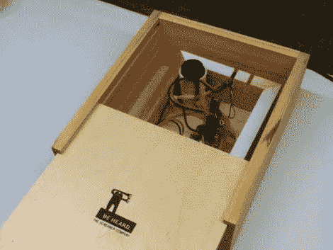

# 回声箱自己摇动发出声音

> 原文：<https://hackaday.com/2011/12/06/echo-box-shakes-itself-to-make-sound/>

[echo box](http://ijprojects.blogspot.com/2011/12/echo-box-using-picaxe-08m-complete.html)正如其名字所暗示的那样执行。如果你在盖子上敲出一个节奏，它会把同样的东西敲回给你。除了它不是敲击来发声，而是振动。

这个概念类似于[敲块](http://hackaday.com/2009/10/02/clock-knock-block-full-of-puns/)。在黑客攻击中，压电元件检测到木制外壳上的敲击声，并通过用螺线管敲击盖子来重复这种节奏。这种迭代也使用压电元件作为传感器。在上图中，你可以看到上角有一段 PVC 管。它容纳了元素，夹在两片酒瓶软木塞之间。软木塞接触到盒子的盖子，将振动传递到元件上。

声音是由一个马达产生的，马达的心轴上有一个配重。当马达旋转时，会引起振动。外壳是一个装在另一个里面的木头盒子，所以振动马达会使内盒相对于外盒振动，从而产生噪音。休息过后，请在片段中亲自聆听。

 <https://www.youtube.com/embed/aIllKsK47X0?version=3&rel=1&showsearch=0&showinfo=1&iv_load_policy=1&fs=1&hl=en-US&autohide=2&wmode=transparent>

 </body> </html>