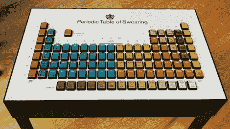

# 元素周期表中的脏话甚至会让一个水手脸红

> 原文：<https://hackaday.com/2011/12/07/periodic-table-of-swearing-would-even-make-a-sailor-blush/>

如果你经常发现自己在激烈的争论中无话可说，也许这个[骂人周期表](http://thatslikewhoa.com/the-periodic-table-of-swearing/)会让你感兴趣。作为英国漫画“现代折腾”的营销工具，这张桌子有超过 100 个水果机(老虎机)按钮，每个按钮都会触发一个厚脸皮单词或短语的音频剪辑。

按钮安装在一块激光切割的 MDF 上，构成了桌子的表面，而所有的电线和机器的内脏都整齐地藏在下面。实际建造桌子的公司 Clay 没有详细说明很多细节，只是说它包括超过 100 米的布线，300 个焊点和大量的脏话。我们想象它可以用一个微型电脑、一个 SD 卡读卡器和几个扬声器来复制——对于任何有兴趣拥有一个自己的扬声器的人来说。

虽然严格来说这不是一个黑客，但我们确信这是一个很好的对话~~开始~~安德，我们确实从下面的演示视频中得到了笑声(警告:语言)。

[谢谢，杰克]

[vimeo http://vimeo.com/28411435 w=470]