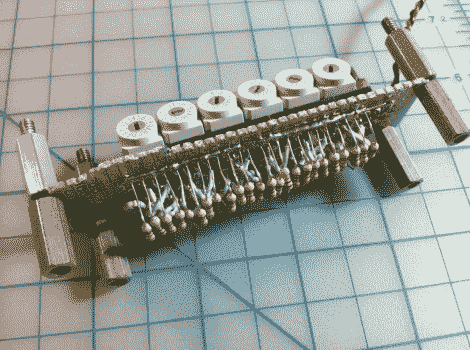

# 一次编程 6502 的一个半字节

> 原文：<https://hackaday.com/2011/12/07/programming-the-6502-one-nibble-at-a-time/>

[Quinn Dunki]继续使用她基于 6502 的计算机构建。这一次，她增加了一些内存来存储程序，但需要一种方法来将代码输入设备。以上是她的解决方案，[一组十六进制开关，用于为每行机器代码编程](http://quinndunki.com/blondihacks/?p=708)8 位命令和 16 位地址。

这是她维罗妮卡项目的延续。上次我们看到它[时，她已经为数据总线](http://hackaday.com/2011/11/30/building-a-computer-around-a-6502-processor/)硬连线了逻辑电平，但这并不有趣，因为实际上什么都不能计算。[奎恩]拿起一个 SRAM 芯片，它将存储程序。它与 6502 的内存总线兼容，但需要一点额外的电路，让她能够用这个开关组对它进行手动编程。她使用一些三态缓冲器在与处理器和十六进制开关的连接之间切换。这样，她使用缓冲区将 ram 与处理器断开，使用开关和按钮输入程序，然后将 RAM 插回到计算机中。

休息后在视频中看到这个过程，肯定会让你体会到打孔卡系统比这种技术有了多大的改进。尽管如此，看到这是一种快乐，我们愿意尝试！ <https://www.youtube.com/embed/XsKTWK7prIA?version=3&rel=1&showsearch=0&showinfo=1&iv_load_policy=1&fs=1&hl=en-US&autohide=2&wmode=transparent>

 </body> </html>