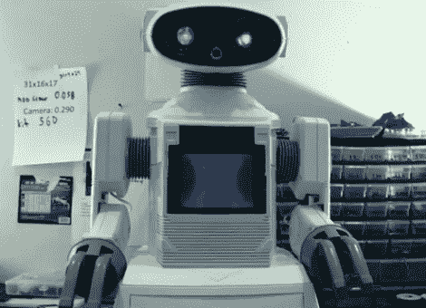

# [DJ Sures]挖出另一个 80 年代的机器人玩具，让它变得很棒

> 原文：<https://hackaday.com/2011/12/08/dj-sures-digs-up-another-80s-robot-toy-makes-it-awesome/>

[DJ Sures]就是控制不住自己摆弄 80 年代制造的机器人玩具。这一次，[他得到了一个 Omnibot-2000](http://www.ez-robot.com/Robots/Omnibot-2000) (不要与[的另一个 Omnibot 黑客](http://hackaday.com/2011/02/19/bluetooth-tomy-omnibot-hack/)混淆)，并为 21 世纪进行了更新。

在完成洗碗机的强制性操作后，机器人的每只手臂上都安装了两个重型伺服系统——一个用于肩膀，一个用于肘关节。他还为机器人添加了另一对伺服系统和一个头戴式摄像头，使它能够环顾四周，并在他的房子里导航。

虽然这些物理修改对[DJ Sures]来说并不新鲜，但他希望机器人的控制方案与他过去所做的不同。除了他在其他项目中构建的标准自主/操纵杆/Wiimote/语音/iPhone 控件，他还为 Omnibot 添加了“视觉字形”控制功能。这意味着机器人可以识别特定的物体和周围环境，使其能够执行与上下文相关的任务。

他正在努力让机器人识别冰箱和客厅，希望最终让 Omnibot 从厨房给他拿饮料——这是我们完全可以做到的事情！

请继续阅读，观看 Omnibot-2000 的两个视频，如果您有兴趣了解更多信息，请访问他的网站。

[https://www.youtube.com/embed/QcQkgS2WW04?version=3&rel=1&showsearch=0&showinfo=1&iv_load_policy=1&fs=1&hl=en-US&autohide=2&wmode=transparent](https://www.youtube.com/embed/QcQkgS2WW04?version=3&rel=1&showsearch=0&showinfo=1&iv_load_policy=1&fs=1&hl=en-US&autohide=2&wmode=transparent) [https://www.youtube.com/embed/i25l50vNSWM?version=3&rel=1&showsearch=0&showinfo=1&iv_load_policy=1&fs=1&hl=en-US&autohide=2&wmode=transparent](https://www.youtube.com/embed/i25l50vNSWM?version=3&rel=1&showsearch=0&showinfo=1&iv_load_policy=1&fs=1&hl=en-US&autohide=2&wmode=transparent)