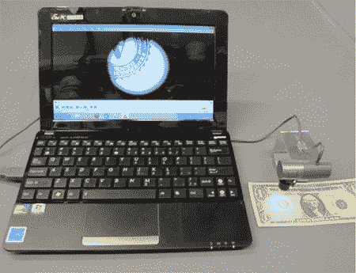

# 将一个网络摄像头和一个胶片摄像头接入 USB 显微镜

> 原文：<https://hackaday.com/2011/12/08/hack-a-webcam-and-a-film-camera-into-a-usb-microscope/>

你们中的大多数人可能都有一个网络摄像头，在你使用一次性相机完成所有高压项目后，我们打赌你也有一些相机镜头。你可以像[Butch]一样，将摄像机镜头和网络摄像头结合起来，进行近距离观察。

这似乎是我们见过几次的东西，但我们无法在我们的档案中找到它。这样一个简单快速的劈砍在他的镜头中看起来出奇的有效。如果你想看细节，比如他在哪里连接到摄像头的电路板来给外部 LED 供电，你必须下载 PDF。