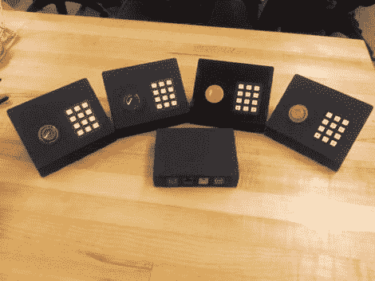

# 教室团队游戏的蜂鸣器项目

> 原文：<https://hackaday.com/2011/12/09/buzzer-project-for-classroom-team-games/>

想和你的朋友一起举办一场危险锦标赛吗？想为你学校的知识碗增加一点公平吗？也许你应该[建立一些你自己的硬件](http://www.instructables.com/id/Game-Controllers)。

这里你可以看到[马特·汉森]接受了这个观点。他使用一个 Arduino 不仅收集蜂鸣器信息，还从四个卫星控制器收集键盘数据。每个都有一个 RJ45 插孔，允许它通过以太网跳线连接到基本单元。我们喜欢[Matt]选择的颜色编码，它将 arcade 按钮的颜色与底座上的 keystone 插孔相匹配。当然，喷水切割表壳的梦幻外观也吸引了我们。

你可能想知道为什么他在每个控制器上都有一个键盘？看起来他和其他几个人一起开发了一个在学校使用的基于团队的数学游戏。