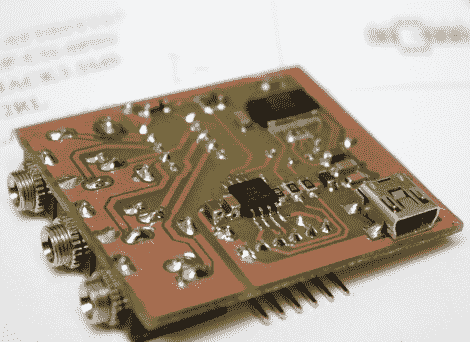

# 微型音频切换器消除了重复的插头交换

> 原文：<https://hackaday.com/2011/12/09/tiny-audio-switcher-eliminates-repetitive-plug-swapping/>

[Phil]在办公桌前工作时使用计算机的扬声器和一副耳机，但他厌倦了为了插入扬声器插头而不断从声卡上取下耳机。他一直想[装配一些东西](http://jumperone.com/2011/12/usb-audio-multiplexer/)使切换输出更容易，但似乎从来没有抽出时间来，直到他最近看到[这个我们推荐的支持局域网的音频切换器。](http://hackaday.com/2011/11/15/audio-output-selection-courtesy-of-the-internet/)

他的 USB 控制开关具有一个音频输入和两个音频输出，他将其安装在一个制作精美的自制双面 PCB 上。可以使用任何终端程序切换开关，通过 FT232R USB 转串行 UART 芯片向板载 ATtiny13A 发送命令。

这个开关的操作非常简单，只需要[Phil]在终端上输入想要的音频频道。ATiny 和一个小继电器完成剩下的工作，将音频引导到正确的输出。