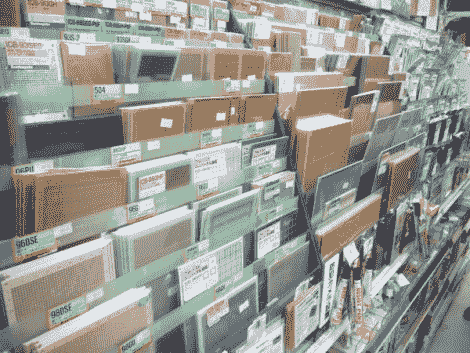

# 秋叶原商店

> 原文：<https://hackaday.com/2011/12/10/ian-shops-akihabara/>

Hackaday 明矾和危险原型创始人[伊恩莱斯内特]是在日本，他已经花了很多时间在秋叶原电气城。对于那些不知道这个名字的人来说，这是一场电子元件盛会，建筑物里挤满了小商店，每个商店专营不同的商品。例如，我们喜欢这张商店的图片，它出售各种可以想象到的原型板、分线板和覆铜板。隔壁的摊位可能除了 led 什么都没有，或者到处都是各种用途的电线。

我们一直在关注(伊恩)关于这次旅行的定期推文。幸运的是，他刚刚发布了秋叶原帖子的综述。令人惊讶的是，他克制自己只买了几样东西。部分原因是对他能带回国的物品数量的限制。另一个原因是价格不一定比你在目录中找到的价格低。他提到，好的一面是你可以在购买前看到零件。这对于调整旋钮、变压器、外壳等很有用。

他包里最令人兴奋的东西是半打类似谢妮的 VFD 显像管，售价仅 12 美元。你愿意出多少钱买下离你不远的这条街上的购物中心？

如果你对秋叶原的视频之旅感兴趣，可以看看东京黑客空间的这个视频。

[via [@dangerousproto](https://twitter.com/#!/dangerousproto)