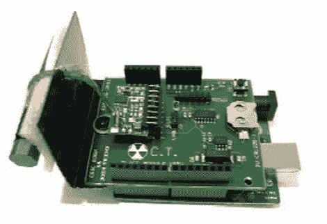

# 超时空原子盾帮助你的 Arduino 保持完美的时间

> 原文：<https://hackaday.com/2011/12/11/chrono-tomic-shield-helps-your-arduino-keep-perfect-time/>

[Josh]和他的实验室伙伴[Eric]需要一个嵌入式系统设计课的期末项目，他们认为设计一个 Arduino 屏蔽会是一个很酷的想法。他们注意到有很多方法可以让 Arduino 保持时间，尽管他们不知道有哪种方法可以直接利用 WWVB(原子时)信号。

[Chrono-tomic Arduino shield](http://www.egr.gvsu.edu/~borne/wordpress/)使用 C-MAX 无线电解调 WWVB 信号，将其解调并传递给 PIC16F1824 微控制器。PIC 解码数据帧并验证其有效性，将时间发送到 MCP79410N 实时时钟模块。

我们已经可以听到“哟 dawg，我喜欢你的微控制器，所以我在你的微控制器盾上放了一个微控制器”的笑话，但这对夫妇说，他们把时间处理卸载到 PIC，以便让 Arduino 专注于它被委派的任何任务。Arduino 代码只需要在需要时向 RTC 请求时间，而不是处理解码本身。

是否矫枉过正？也许——尽管我们认为这在很大程度上取决于您的应用和配置。我们当然可以想象出它有用的情况。