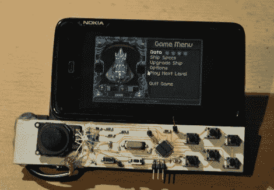

# 诺基亚 N900 控制面板非常适合在旅途中玩游戏

> 原文：<https://hackaday.com/2011/12/12/nokia-n900-control-pad-is-perfect-for-gaming-on-the-go/>

[Andrzej]喜欢他的诺基亚 N900，指出它是一款出色的便携式游戏设备。由于它支持各种各样的模拟器，它非常适合在旅途中满足他的游戏怀旧之情。他说，N900 的一个缺点是键盘让游戏变得不容易，也不舒服。

为了让游戏变得更有趣，[他给自己做了一个附加的游戏手柄](http://emerythacks.blogspot.com/2011/12/n900-gamepad.html)，可以完美地放在手机的键盘上。通过手机的 USB 端口连接，它有 8 个按钮和一个 PSP 操纵杆。他使用 ATmega8A 作为控制器的大脑，通过 USB 键盘与手机进行通信。他说，这种配置使得在每个游戏的基础上进行各种自定义按钮映射变得非常容易。

正如你在上面的图片中看到的，控制器目前缺少一个外壳，但我们认为，通过一点巧妙的包装，它可以看起来像一个零售插件一样好。

看看下面的短视频，看看他的游戏手柄。

 <https://www.youtube.com/embed/nPLLmpMCu1U?version=3&rel=1&showsearch=0&showinfo=1&iv_load_policy=1&fs=1&hl=en-US&autohide=2&wmode=transparent>

 </body> </html>