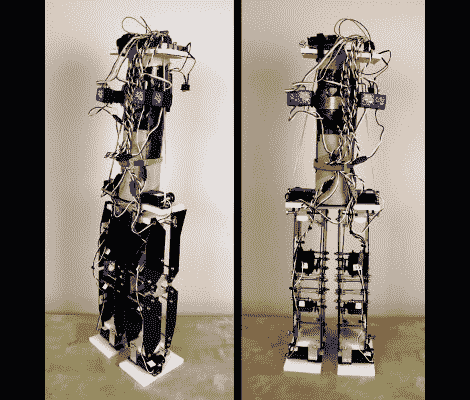

# Android 腿稳定性测试

> 原文：<https://hackaday.com/2011/12/13/android-legs-stability-testing/>

这是[詹姆斯]最新的机器人产品，[一组使用陀螺仪保持平衡的腿](http://www.xrobots.co.uk/android-11/)。

他首先用一些乐高积木来规划建筑，以了解每个脚和腿的关节是如何组合在一起的。这让他实现了他的一个目标。从一开始，他就想创造一个保持稳定的机器人，如果出现问题，它不会积聚足够的动量而翻倒。尺寸确定后，他用业余爱好刀从 2 毫米厚的臀部塑料片上切下部分。它们与由铝和高密度聚乙烯制成的框架一起工作。整个装置包含八个负责运动的伺服系统，但他发现了一种有趣的方式来使用它们来保持平衡。

[James]发现了一些陀螺传感器，是为遥控直升机制造的。它们与伺服电机串联，并根据陀螺仪数据进行偏移。他在这个机器人身上用了四个，用臀部和脚踝的伺服系统来保持平衡。结果是一组腿看起来像他们的 jonesin 固定。休息后在片段中自己看吧。

[https://www.youtube.com/embed/904erau8z_M?version=3&rel=1&showsearch=0&showinfo=1&iv_load_policy=1&fs=1&hl=en-US&autohide=2&wmode=transparent](https://www.youtube.com/embed/904erau8z_M?version=3&rel=1&showsearch=0&showinfo=1&iv_load_policy=1&fs=1&hl=en-US&autohide=2&wmode=transparent)