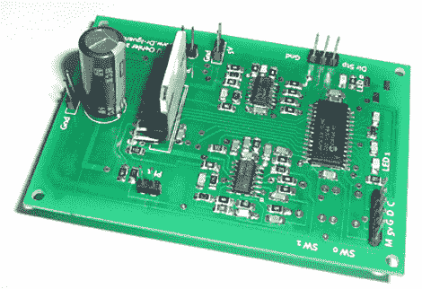

# 高速步进驱动:每秒 25k 步

> 原文：<https://hackaday.com/2011/12/14/high-speed-stepper-driving-25k-steps-per-second/>

步进电机很容易用微控制器来控制。但是如果你想跑，那么在每秒高转数的情况下，事情会变得很棘手。[Uwe]多年来一直在学习和构建步进驱动器，最近他决定[基于微芯片参考设计](http://www.dr-iguana.com/prj_StepperDriver/)构建高性能驱动器。

与参考设计一样，他的评估板使用 dsPIC33。但他没有使用一系列分立的 MOSFETS 来切换信号到电机，而是采用了 L298N 电机驱动器。就是它贴在大电容器旁边。当硬盘驱动时，它需要自己的散热器，这是从一个更大的 CPU 散热器上切下来的。在开发过程中，他决定使用基于中断的 PWM，而不是 dsPIC 提供的硬件 PWM。这很有效，但如果再来一次，他会走另一条路。

对于行人，休息后的视频有你需要的所有细节。对于那些真正想深入研究的人来说，[Uwe 的]多页文章值得收藏。

 <https://www.youtube.com/embed/8_iJ-XGpFvs?version=3&rel=1&showsearch=0&showinfo=1&iv_load_policy=1&fs=1&hl=en-US&autohide=2&wmode=transparent>

 </body> </html>