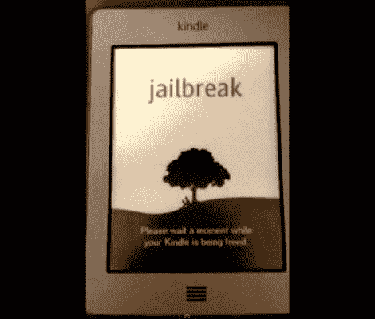

# Kindle Touch 越狱是如何被发现的

> 原文：<https://hackaday.com/2011/12/14/how-the-kindle-touch-jailbreak-was-discovered/>

[Kindle Touch 已经扎根](http://yifan.lu/2011/12/10/kindle-touch-5-0-jailbreakroot-and-ssh/)！休息后嵌入了一段验证视频，但关于这一发现，最精彩的部分是[Yifan Lu]深入描述了他是如何发现并利用设备中的一个安全漏洞的。

该过程从获取固件转储开始。如果你移开机箱，不难发现板上的串行端口，他做到了。但是那个时候，已经有人把这张照片上传了。我们猜测你可以说[一帆]被他在拆解中发现的东西震惊了。与过去的 Kindle 设备相比，这是一次彻底的重写，似乎有很多地方需要被黑客攻击。引导装载程序没有被锁定，但是摆弄它是一个很好的方法。Javascript 是用于 UI 的语言，没有混淆，亚马逊为后来的插件提供了许多挂钩。长话短说，对以前 Kindles 的攻击在这里不起作用，但对软件进行逆向工程并编写新的应该很容易。

访问设备就像在 UI 中注入一些 HTML 代码一样简单。然后由设备作为 root 运行(不是开玩笑！).[Yifan]抓取了一个 MP3 文件，将其标签信息更改为 HTML 攻击代码，然后在设备上播放该文件以利用该漏洞。来自非法下载的 MP3 文件的恶意数据多久会在其中一个文件上隐藏根文件系统？

 <https://www.youtube.com/embed/HMyv6nSAOU0?version=3&rel=1&showsearch=0&showinfo=1&iv_load_policy=1&fs=1&hl=en-US&autohide=2&wmode=transparent>

 
[via <a href="http://www.reddit.com/r/gadgets/comments/n8h75/kindle_touch_50_jailbreakroot_and_ssh/" target="_blank"> Reddit </a>
 </body> </html>