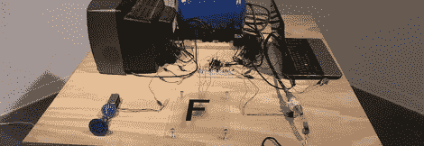

# 审查电视上所有的脏话

> 原文：<https://hackaday.com/2011/12/15/censoring-all-the-f-words-on-tv/>

[Milton]派了一个建筑来检查电视上每一个 F 字，不仅仅是和 duck 押韵的那个。每当有人在电影盒子里说出一个包含字母 f 的单词时，他的装置就会发出警报。

这个构建是基于益智设计公司的[视频实验者防护罩](http://hackaday.com/2011/03/24/video-experimenter-shield/)。这个整洁的小盾牌已经被用作[视频采样器](http://hackaday.com/2011/07/15/arduino-video-sampler/)，并分析了[的发言人实际上在说什么](http://hackaday.com/2011/07/19/analyzing-tvs-talking-heads-with-processing/)。Video Experimenter Shield 支持隐藏字幕，这意味着可以实时阅读电视节目的文字记录。所有[米尔顿]必须做的就是让“F 字”警报响起来。

(米尔顿)称其为 F 芯片，包括三个输出——一个螺线管发出自行车喇叭的声音，通过哨子发送一些空气，并点亮一个“F 字”警报。从 F-Chip 运行的视频(休息后可用)中，我们可以看出这个构建非常棒，非常有思想，也很烦人。让它变得更烦人的唯一方法是发出一个“E-word”警报，但是有办法绕过这个。

<https://player.vimeo.com/video/33553853>

 </body> </html>