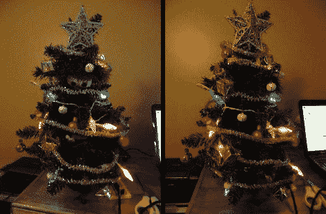

# 为圣诞节装饰一个房间

> 原文：<https://hackaday.com/2011/12/15/decorating-an-ent-for-christmas/>

这些图像可能看起来一样，但是如果你仔细看左边的那张，你会发现那双眼睛正盯着你。今年似乎流行电子装饰，我们认为[峡湾·卡弗的]会说话的圣诞树是更好的产品之一。

他在一元店挑选了这棵小树，然后开始添加在休息后的节目中看到的作品。一小段电池供电的灯和一些花环是传统的。但是 Arduino 和一对伺服电机是一个新的节日传统。他们移动树的一部分来显示一对眼睛和一张嘴巴。他通过从计算机向 Arduino 发送串行命令来驱动显示器。这样你就可以编写你的表演脚本，在电脑提供声音的同时，用拍打的下巴，移动的眼睑和闪烁的灯光。

只有我们，或者其他人真的想看这个人唱花栗鼠的圣诞歌吗？或者如果那有点太健康，你可以走[更粗俗的路线](http://hackaday.com/2011/12/13/naughty-duck-will-be-the-end-of-secret-santa-at-your-place-of-work/)。

 <https://www.youtube.com/embed/Cmjsczz-Tbs?version=3&rel=1&showsearch=0&showinfo=1&iv_load_policy=1&fs=1&hl=en-US&autohide=2&wmode=transparent>

 </body> </html>