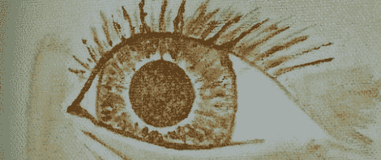

# 用无机化学制造油漆

> 原文：<https://hackaday.com/2011/12/16/making-paint-with-inorganic-chemistry/>

早在文艺复兴时期，伟大的艺术家如莱昂纳多、米开朗基罗和拉斐尔会创作自己的颜料。当然，颜料非常便宜且容易获得，但这并不意味着你不能通过玩化学来制作自己的颜料。

去年夏天，费城黑客空间的 Sean 用 T2 铁磁流体做了一些实验。为了这些实验，Sean 从生锈的铁螺丝中准备了一些磁铁矿。在这个过程中形成了大量的氢氧化铁，它可以产生奇妙的颜色。标题图片中的红棕色眼睛是由漂浮在[肖恩]烧杯顶部的一些东西制成的。

[肖恩]真的在寻找真正黑色的东西，所以他把努力转向赤铁矿，一种非常黑的颜料，现在正与其他金属一起产生一些有趣的颜色。他已经用两种铜化合物制成了绿色和黄色颜料。我们只能希望当他开始拆开水银开关让[变成红色](http://en.wikipedia.org/wiki/Cinnabar)时，他会使用通风橱。