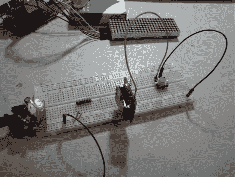

# Xbee 远程传感器会在有人进入你家时告诉你

> 原文：<https://hackaday.com/2011/12/18/xbee-remote-sensors-tell-you-when-someone-enters-your-home/>

[比尔·波特]正在帮助一个朋友为她的家设计一个简单的安全系统。它依靠 Xbee 模块在门被打开或压力垫被踩上时向基站发出警报。

门传感器非常简单，你可能已经很熟悉了。一部分安装在门上，其中有一个磁铁，另一部分安装在门框上，有一个簧片开关，当磁铁就位时，该开关闭合触点。地垫使用两片导电材料，中间用泡沫隔开。当它被踩下时，电路就完成了，并且可以被 Xbee 感知为按钮按压。

这些传感器向一个 Arduino 基站报告，该基站有一个蜂鸣器和三个 8×8 LED 模块，用于滚动显示哪个传感器被触发的信息。[Bill]很好地展示了如何配置 Xbee 网络，如果你以前从未使用过硬件的话。

休息之后你会看到他的演示视频。

 <https://www.youtube.com/embed/D-Cw5Dm40gE?version=3&rel=1&showsearch=0&showinfo=1&iv_load_policy=1&fs=1&hl=en-US&autohide=2&wmode=transparent>

 </body> </html>