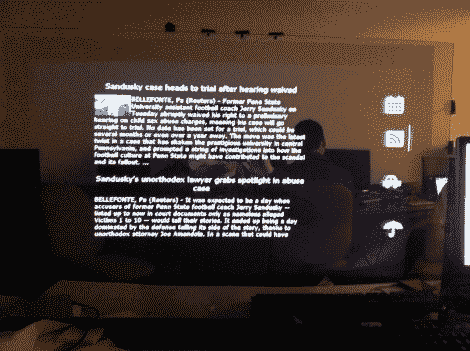

# 云镜将互联网添加到你的晨间仪式中

> 原文：<https://hackaday.com/2011/12/18/cloud-mirror-adds-internet-to-your-morning-ritual/>

这面镜子后面有一个大显示器，可以用手势操作。这是来自[Daniel Burnham]、[Anuj Patel]和[Sam Bell][的团队努力的结果，他们在佐治亚理工学院为他们的 ECE 4180 班级建造了一个网络镜像](http://www.prism.gatech.edu/~dburnham6/4180/index.html)。

到目前为止，他们已经为系统实现了四个小部件。您可以在镜子右侧的栏中看到激活每个按钮的图标。从上到下依次是日历、新闻、交通和天气。休息后的视频显示了用于控制显示器的手势。首先，将手放在适当的图标上选择小部件。接下来，沿着镜子的顶部从右向左滑动，将小部件带到主显示区域。

硬件细节在[他们的演示幻灯片](http://www.prism.gatech.edu/~dburnham6/4180/final.pdf) (PDF)中更自由地分享。当用户足够靠近屏幕时，声纳距离传感器会激活该设备。七个红外反射传感器检测放在他们面前的手。我们喜欢这种输入法，因为它可以让“显示”区域没有指纹。但是我们想知道红外传感器是否可以放在玻璃后面而不是旁边？

[https://www.youtube.com/embed/yMn7XY8uzgw?version=3&rel=1&showsearch=0&showinfo=1&iv_load_policy=1&fs=1&hl=en-US&autohide=2&wmode=transparent](https://www.youtube.com/embed/yMn7XY8uzgw?version=3&rel=1&showsearch=0&showinfo=1&iv_load_policy=1&fs=1&hl=en-US&autohide=2&wmode=transparent)