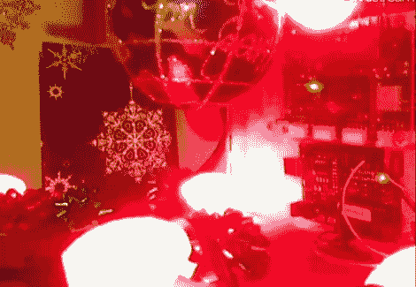

# CheerLights:全球同步圣诞灯

> 原文：<https://hackaday.com/2011/12/17/cheerlights-synchronizing-christmas-lights-around-the-globe/>

他们说，假期是与他人聚会的时间，这通常意味着与朋友和家人共度时光。ioBridge 实验室的人认为，虽然朋友和家人肯定是节日的重要组成部分，但通过使用互联网同步他们的圣诞灯来聚集一群陌生人会很酷。

参加 CheerLights 相当容易，只需要一个互联网连接，一些通用 G-35 彩色特效灯，一个 Arduino 和一个 T2 io bridge。虽然这些都是推荐的组件，但 Arduino 以太网屏蔽同样可以处理网络。当涉及到硬件时，真的没有限制，所以如果你愿意，使用简单的 RGB LEDs 和你选择的交流电来滚动你自己的显示器应该是相对容易的。

这些颜色是由该组织的 Twitter feed 决定的，可以在[http://twitter.com/#!/@cheerlights.](http://twitter.com/#!/@cheerlights)找到。每当一条信息连同一种颜色一起被发送到@cheerlights，所有收听的灯光显示将同时改变。

我们真的很喜欢这个想法，并认为这将是非常酷的看到这种程序推出了一个社区或街道的水平，所以你可以看到几十个字符串改变颜色一次。

如果你对 CheerLights 当前的颜色感兴趣，一定要看看他们在这里的直播。

[通过 [BuildLounge](http://www.buildlounge.com/2011/12/14/cheerlights-twitter-enabled-cheer/)