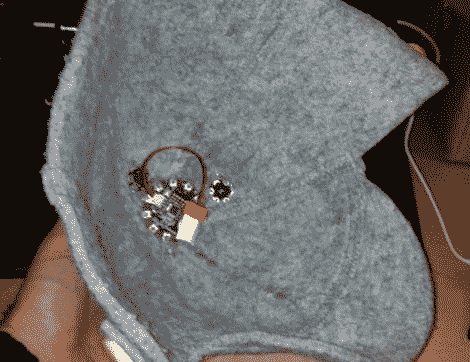

# 头戴式灯光显示器随时随地为节日带来欢乐

> 原文：<https://hackaday.com/2011/12/18/head-mounted-light-display-takes-holiday-cheer-on-the-go/>

我们每年这个时候看到的大多数节日灯饰都是固定的，或者至少局限在某人的家里。[【Marco Guardigli】想要带着他的灯出门](http://marco.guardigli.it/2011/12/arduino-lilypad-cyberhat.html)，他认为一顶亮起来的冬帽将是展示他节日精神的完美之选。

冬天，他戴着一顶结实的羊毛毡帽，这是安装 led 的理想选择。他拿起一个基本的 LilyPad Arduino，它使用一个小的 LiPo 电池作为电源，用一点胶水将其安装在帽子内。他在帽子周围连接了一系列 SMD LEDs，它们很好地融入了毛毡中，当断电时肉眼几乎看不见它们。然而，当他打开 LilyPad 时，没有错过明亮的蓝色 led，也没有从他也安装在帽子上的小扬声器发出的音乐。

我们认为[Marco 的]显示器很棒，如果我们要建造一个，我们可能会在我们的显示器中包含大量的红色和绿色 led。你们中有谁会随身携带圣诞彩灯吗？我们很想看到它们，所以一定要在评论中让我们知道。

留下来看一个关于[马可的]帽子的短片。

 <https://www.youtube.com/embed/iq0bxr3UKyw?version=3&rel=1&showsearch=0&showinfo=1&iv_load_policy=1&fs=1&hl=en-US&autohide=2&wmode=transparent>

 </body> </html>