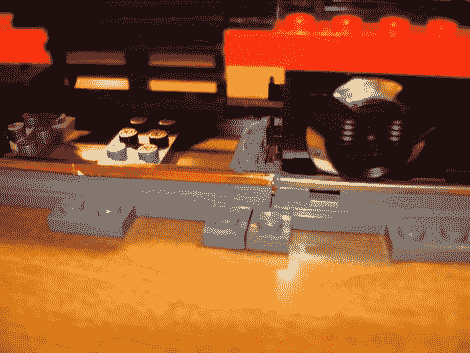

# 改造现代乐高火车轨道，用于旧版本

> 原文：<https://hackaday.com/2011/12/19/retrofitting-modern-lego-train-tracks-for-use-with-older-version/>

所以你真的在寻找那个[诺曼·洛克威尔]圣诞节，并且想在今年设置你的火车环绕圣诞树。问题是，你只有一套旧的乐高玩具火车，却没有足够的轨道。不能随便多买一些，因为技术变了；还是可以？

[Chris]沮丧地发现，较新的乐高火车组已经采用电池供电，而不是通过金属轨道供电。新的轨道是塑料的，购买旧版本的额外部分成本过高。他想出了一个办法来给新的轨道部件增加电源线。

事实证明，新轨道的设计与旧轨道一致，只是它们都是塑料的，而不是金属轨道。他买了一套塑料附件，然后从业余爱好商店买了一些用于彩绘玻璃的铜箔。这是背胶，在找到最好的使用方法后，他用这种材料涂在了铁轨上。正如你在上面看到的，新的与旧的完美结合，让火车头继续前进。

如果你在这次黑客攻击后留下了铜箔，它还有很多其他用途。或许[打造自己的柔性传感器](http://hackaday.com/2009/07/25/custom-flex-sensors/)值得一试。