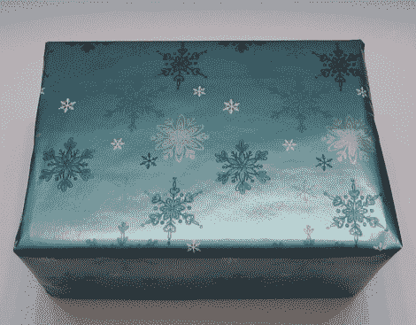

# 恶作剧礼物让好奇的手不敢靠近

> 原文：<https://hackaday.com/2011/12/19/prank-gift-keeps-curious-hands-at-bay/>

你们都认识那个人。

那个拿起每一件上面有他们名字的礼物，摇了摇，然后冲进他们最好的 Carnac the greetive impression。见鬼，你可能就是那个人。

[Jason]正在思考如何在他的生活中对抗礼物摇动器，并设计了一个简单的恶作剧，当摇动和猜测开始时，肯定会给他带来一些乐趣。

他买了一个预制的音频模块，可以存储大约 20 秒的声音，用一对电线取代了按钮触发器，当盒子被大力移动时，电线可以很容易地接触到。所有的东西都被小心翼翼地装在一个礼品盒里，然后包装好放在树下，给渴望礼物的人一个惊喜。

我们肯定喜欢这个想法，因为有太多的方法来定制/增强[Jason 的]工作，以满足您的特定需求。无论你是把小猫/小狗放在一个盒子里，还是装上令人难以置信的大警报，你的常驻礼物检查员再也不会以同样的方式看待礼物了！

继续阅读，查看[Jason]更详细地解释他的礼物恶作剧。

 <https://www.youtube.com/embed/ZeCjiEiPqAM?version=3&rel=1&showsearch=0&showinfo=1&iv_load_policy=1&fs=1&hl=en-US&autohide=2&wmode=transparent>

 </body> </html>