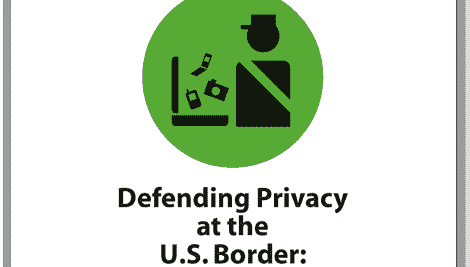

# 跨境时保护数字信息的效果

> 原文：<https://hackaday.com/2011/12/21/eff-on-securing-digital-information-when-crossing-the-border/>

电子前沿基金会是电子领域普通人权利的长期捍卫者，它出版了一份指南，指导你在进入美国时如何保护你的数字设备的隐私。看起来自由和自由的捍卫者(ICE、DHS、TSA 和 CBP)能够通过没收你的设备和他们存储长达五天的数据副本，在边境口岸夺走你的一些自由。这不需要怀疑有不法行为，并且这些数据的副本可以与其他机构共享，从而取消五天的限制。

你有理由保护你的数字财产吗？本文对此进行了探讨。它可能是商业合同或职业关系(医生、律师、记者等)中的机密信息。).或者你可能只是想在原则上保持你的隐私。不管你的立场是什么，EFF 在这篇有趣的文章中涵盖了所有的基础。我们认为他们给出的最佳建议是对你在互联网上的数据进行加密备份，在过境前清空你的电脑，到达目的地后再恢复。如果你没带着数据，那就不能妥协。如果这不是一个选项，他们有大量的密码技术指南。

[via [Twitter](https://twitter.com/#!/marciahofmann/status/149283399717236738)