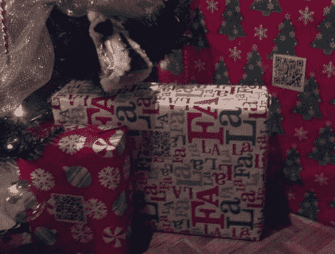

# 让圣诞礼物猎人猜测与二维码礼品标签

> 原文：<https://hackaday.com/2011/12/22/keeping-christmas-present-hunters-guessing-with-qr-code-gift-tags/>

萨德·布鲁克斯是一个最令人讨厌的父亲。他的孩子们不断地试图弄清楚爸爸妈妈给他们买了什么圣诞礼物，而他却不断地想办法阻碍他们的进步。他当然可以[在圣诞树下](http://hackaday.com/2011/12/19/prank-gift-keeps-curious-hands-at-bay/)放一些恶作剧礼物，但是他选择走一条不同的路线，用二维码混淆他挥舞着智能手机的孩子们。

圣诞树下的每件礼物都没有名字标签，而是贴有一张二维码贴纸，是[Thadd]打印出来的。当扫描时，代码会把他的孩子带到他的网络服务器上的一个页面，说明礼物是给谁的。

有什么问题吗？好吧，代码每次都会弹出一个随机的页面，把这个礼物归属于这个家庭的每一个成员。当[萨德]打开服务器上的开关，显示出真正的礼物接收者时，在平安夜之前，没有任何一个孩子能够正确识别他们的礼物。

这当然是一个聪明但令人沮丧的方法，让他的家人保持警惕，我们认为这是一个非常棒的主意。

如果你想看看他创建的一些迷惑孩子的网页，只需点击上面链接中的“搜索”按钮。