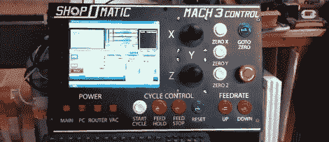

# 茂名 a 数控路由器

> 原文：<https://hackaday.com/2011/12/22/mameing-a-cnc-router/>

[Ed]是相当老的学校。他喜欢拥有自己专用系统的老式工业车间工具的功能。有巨大的糖果一样的按钮，谁不会呢？[Ed]决定复制这种美学，为他的 [Mach3 控制的](http://www.edsjunk.net/Blog/EdsJunk/Blog/Entries/2011/12/21_Dedicated_Mach3_Control_Panel.html)路由器建造一个 MAME 控制器。

[Ed]在一个被遗忘的项目中有一堆 MAME 按钮和操纵杆。有了他的乙烯绘图仪，制作一个非常漂亮的控制面板就相对容易了。为了将按钮连接到 Mach3 电脑上，一个废弃的 I-Pac 被混合在一起。I-Pac 读取按钮的状态，并通过 USB 向计算机发送键盘代码。

因为非常流行的 [Mach3 CNC 软件](http://www.machsupport.com/)会响应热键，所以让按钮按照它们所说的那样做是非常简单的。[Ed]完全控制 X、Y 和 Z 轴以及主轴速度。似乎在[Ed]的路由器上做一些“自由形式”的 CNC 工作会很有趣。

 <https://www.youtube.com/embed/KvhJj1yzqks?version=3&rel=1&showsearch=0&showinfo=1&iv_load_policy=1&fs=1&hl=en-US&autohide=2&wmode=transparent>

 </body> </html>