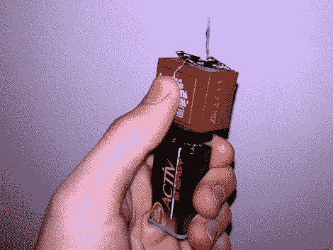

# 用 2000 伏电压使任何纸片都有粘性

> 原文：<https://hackaday.com/2011/12/23/make-any-scrap-of-paper-sticky-with-2000-volts/>

一点物理知识就够了，谁还需要化学呢？瓦伦丁制造了这个手持设备来给纸片增加静电电荷，而不是调制一批弱粘合剂来制作他自己的便利贴。只要给它们几秒钟充电，它们就会轻松地粘在墙上。

充电电路非常简单，包括一个变压器、晶体管、电阻和四个整流二极管。他带领我们完成构建过程，使用变压器外壳作为基础自由形成电路。一旦电路完全组装好，就添加一个 9 伏电池连接器，并将易碎部分热粘合到位。它可以将输出电压一直提升到 2 kV，但它仍然是安全的，因为它的电流非常低。

这个概念类似于上个月看到的高压公告板。我们想知道，如果没有一个有效的电气连接来保持电荷，这些纸币会在原地停留多久？