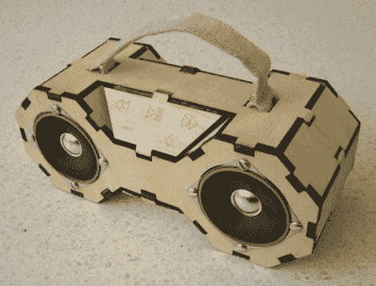

# 组合在一起的音箱非常适合随身携带音乐

> 原文：<https://hackaday.com/2011/12/23/snap-together-boombox-great-for-taking-your-music-on-the-go/>

[Matt Keeter]想把他的音乐带在身边，写信来分享他花了不到 100 美元建造的一个看起来很棒的音箱。他的目标是把几乎任何黑客空间/fab 实验室都可以制造的东西放在一起，所以他的音箱是用简单的材料制成的。

他首先用硬纸板做了一个音箱模型，然后用激光切割机从木头上制作出来。这种设计允许立体声系统咬合在一起，尽管[马特]说一些接头被粘在一起作为额外的预防措施。内置一个定制的 PCB，内置一个 ATmega328，一个 MP3 解码器和一个 SD 卡来存储他的音乐。

我们真正喜欢的一个功能是内置在音箱中的控制方案[Matt]。每个电容式触摸按钮都位于铜垫的顶部，铜垫通过导线连接到控制板。他说，虽然理论上不错，但他很难让按钮正常工作，尽管它们似乎做得足够好。

如果你正在寻找一个便携式音乐解决方案，并有一个激光切割机，一定要检查[马特]的图表和固件页面。