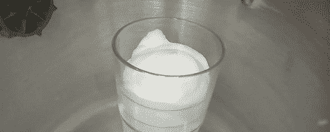

# 压力锅的真空室

> 原文：<https://hackaday.com/2011/12/23/a-vacuum-chamber-from-a-pressure-cooker/>

[Allan]需要一个小真空室来清除透明浇铸树脂中的所有空气。除气是铸造过程中的一个简单步骤，可以极大地改善成品。然而，问题是建造一个真空室。[【艾伦】的小室](http://dibblah.pwp.blueyonder.co.uk/VacuumChamber/)似乎很容易建造，并且抽出足够的空气达到 0.1 个大气压。

在高压锅的侧面钻了一个孔后，[Allan]安装了一个 15 毫米的“speedfit”塑料罐连接器。连接器周围的密封是氯丁橡胶自粘泡沫。这种泡沫也被贴在高压锅顶部的边缘。

一个厚壁的高压锅在真空下能够承受更多的外部压力，但是[Allan]警告不要在顶部使用丙烯酸塑料。丙烯酸有灾难性失败的倾向，所以他用了厚厚的一层 Lexan。休息之后，看看[Allan]从剃须膏中吸出空气的演示视频。

 <https://www.youtube.com/embed/ec7rjOk-FzM?version=3&rel=1&showsearch=0&showinfo=1&iv_load_policy=1&fs=1&hl=en-US&autohide=2&wmode=transparent>

 </body> </html>