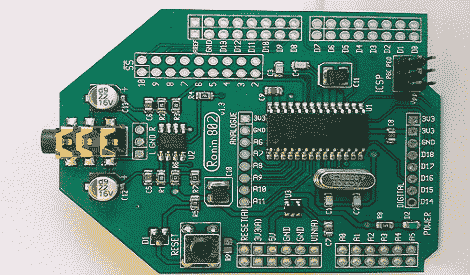

# 非芯片调谐倾斜的数字合成器

> 原文：<https://hackaday.com/2011/12/24/digital-synth-for-the-non-chiptune-inclined/>

Chiptunes 很棒，我们无法想象没有 Mega Man 2 原声带的世界，但有时我们都喜欢更 70 年代风格的合成器。这就是 [Roninsynth](http://www.roninsynth.com/) 介入的地方。这是一个 Arduino 盾，它将 synth 的[墙的基本组件放入你的口袋。](http://sequencer.de/moog/moog_synthesizer_module.html)

与以往的模拟振荡器不同，Roninsynth 基于单个 [dsPIC33F](http://www.microchip.com/wwwproducts/Devices.aspx?dDocName=en532298) 芯片。它具有我们期望从它的老大哥那里得到的所有波形——正弦、saw、三角形、方形和噪声——以及一些调制选项。真正有趣的是 Roninsynth 团队组装的 [GUI](http://www.roninsynth.com/?page_id=104) 。与 MIDIbox SID 的[旋钮和按钮](http://hackaday.com/2010/02/08/modded-c64-eye-candy/)方法不同，Roninsynth 用软件做所有事情。可以把它想象成一个基于硬件的软同步。

当然，它不支持像昨天我们看到的这样的循环和短语，但是它可以发出大量优美的声音，并且具有模拟输入的能力。如果你想听起来像电台司令，我们想不出更简单的方法来制作 [Ondes Martenot](http://www.youtube.com/watch?v=Yy9UBjrUjwo) 。