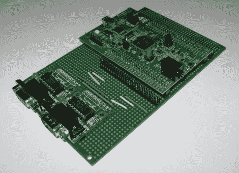

# [斯考特]为他的手臂准备分线板

> 原文：<https://hackaday.com/2011/12/23/scot-whips-up-breakout-board-for-his-arm-breakout-board/>

[Scot Kornak]得到了新的 STM32 发现板。他得到了一个免费赠品，但只要 18 美元，他可能还是会买一个。他对该设备的一个抱怨是，打断 ARM 处理器引脚的双引脚接头对于连接外部组件来说不是最方便的。他决定让[成为自己的分线板](http://kornakprotoblog.blogspot.com/2011/12/breakout-board-for-stm32f4-discovery.html)，这将为他一直使用的组件提供更强大的解决方案。

他选择的原型板非常有趣。它用于连接 DIL 引脚接头，就像 STM32F4 发现板上的引脚接头一样。双接头的每一行都垂直于这些接头向下运送。[Scot]切断 STM32 电路板下方的走线，以隔离左右两侧。然后，他在一侧添加了 RS232 硬件，同时包括另一对 DIL 接头，以断开其余未使用的引脚。

这是他目前所得到的全部，但是在基板上有足够的空间来增加更多的需求。