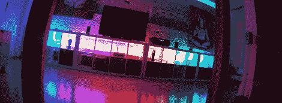

# StripInvaders 将彩色灯随处可见

> 原文：<https://hackaday.com/2011/12/26/stripinvaders-puts-colored-lights-everywhere/>

住在迪斯科舞厅里没什么好处，但彩色灯光很棒，尤其是当它们像[michu]的[striping vaders](http://neophob.com/2011/12/stripinvaders-light-system/)那样实现得很好的时候。

StripInvaders 项目采用一个带有 WS2801 控制器的巨大 5 米 [LED 条](http://pixelinvaders.ch/?page_id=390)，并通过新的 Arduino 以太网将其变成一个支持以太网的 24 位显示器。虽然支持以太网可能看起来有点多余，但[michu]很好地实现了它。整个 5 米长的 LED 灯条可以通过平板电脑或智能手机进行控制。

除了带有 OSC 的平板电脑/智能手机界面，还有 mDNS 支持，所以我们确信 StripInvaders 可以通过适当的脚本创建一个有趣的局域网聚会。虽然 LED 灯本身的成本相当高，但我们相信一些黑客评论者会提出一个更便宜的解决方案。

StripInvaders 的固件已经发布在 Github 上，但是真正的享受，请在休息后查看演示。

[https://player.vimeo.com/video/33992255](https://player.vimeo.com/video/33992255)