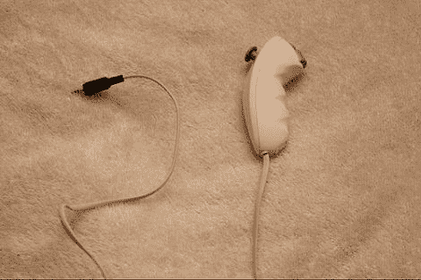

# 山寨游戏控制器制作精美的遥控快门

> 原文：<https://hackaday.com/2011/12/29/knockoff-game-controller-makes-a-fine-remote-shutter-release/>

[Duncan Murdock]在圣诞节收到了一部佳能 DSLR 相机，他想要一部遥控快门相机。因为圣诞节时没有一家商店开门，所以他的运气很差。他在零件抽屉里翻来翻去，发现了各种等待重复使用的好东西，包括一个仿制的 Wii 双截棍。

他从双节棍上拔下原来的电缆，换上一根旧电话线，在末端接上一个 2.5 毫米的插头。插头直接插入他相机的控制端口，允许他按下按钮触发自动对焦和快门机制。

我们喜欢垃圾控制器被回收用于相机的想法，尽管我们认为它比用作简单的有线触发器更有潜力。如果双截棍和相机都配备了某种无线接口([蓝牙](http://hackaday.com/2011/09/01/robust-wireless-dslr-control-over-bluetooth/)、[红外](http://hackaday.com/2011/12/08/ir-remote-for-dslr-cameras/)、[等等](http://hackaday.com/2011/05/26/long-range-canon-dslr-remote-video-trigger/)，我们认为这将是任何业余摄影爱好者的一个很好的补充。