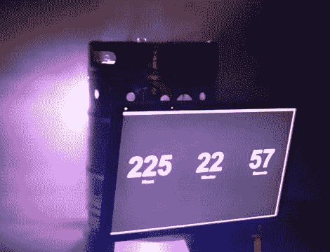

# 红色的末日桶帮助迎接新的一年

> 原文：<https://hackaday.com/2011/12/30/doomsday-keg-of-radness-helps-ring-in-the-new-year/>

许多人在新年前夜买噪音制造器，其他人选择唱《友谊地久天长》——然后就是这些家伙。

Stone Brewing Company 的工作人员在他们的酿酒厂举办了一年一度的狂欢庆祝新年，虽然[【迪诺的】倒计时器](http://hackaday.com/2011/12/30/build-your-own-mini-ball-drop-for-new-years-eve)非常适合亲密的环境，但他们需要更大的东西来取悦观众。一个破裂的半桶是他们建造“末日放射性桶”所需的全部灵感。

斯通公司的创意总监迈克·帕尔默(Mike Palmer)将小桶交给维修人员进行改造，并准备给它装上各种各样的灯和其他物品。桶上钻的孔装有明亮的脉冲发光二极管，而额外的发光二极管光带分布在周围。底部被切掉，以容纳一个月光花 LED 模块，一个 24 英寸的显示器绑在旁边，以显示倒计时定时器。一台塞在桶里的旧 Macbook 运行视频显示，而其余的照明则由射频发射器远程控制。

现在请注意，这一切都发生在去年，但由于展览如此成功，他们将在 2011 年的庆祝活动中再次展示。

查看下面的简短演示视频，了解末日小桶的运行情况。

[vimeo http://vimeo.com/18100621 w=470]