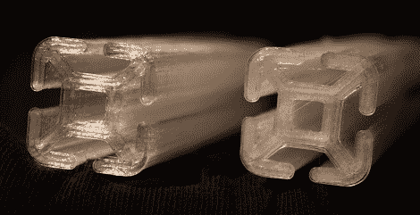

# 用透明聚碳酸酯印刷

> 原文：<https://hackaday.com/2011/12/30/printing-with-clear-polycarbonate/>

我们这些使用 3D 打印机的人在选择打印材料时有两个主要选择——ABS，一种非常硬的塑料，和 PLA，一种熔点较低的更脆的塑料。[Alex]和[Luke]一直在尝试用标准的 3D 打印机打印聚碳酸酯并创造出清晰的晶体物体。

[卢克]第一次尝试印刷聚碳酸酯并不顺利。物体出来看起来非常乳白色，在细丝挤出过程中有一点爆裂。这些人解决了这个问题，他们将聚碳酸酯细丝放入食物脱水机中过夜以去除水分。聚碳酸酯的熔点高于其他塑料，约为 260 摄氏度，这可能会给挤出机热端的特氟隆绝缘体带来一些问题。不过，这些人对烟雾没有任何问题。

如果你曾经想打印一些清晰的东西，现在看来这是可能的。休息后看看视频，看看 Makerbot 用透明聚碳酸酯自动打印的东西。

 <https://www.youtube.com/embed/AnmTjoua1gI?version=3&rel=1&showsearch=0&showinfo=1&iv_load_policy=1&fs=1&hl=en-US&autohide=2&wmode=transparent>

 </body> </html>