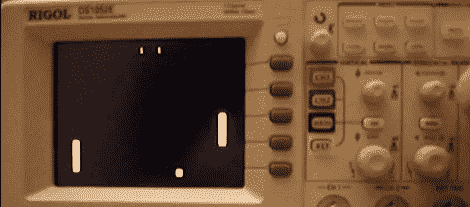

# Rigol DS1052E 范围内的自制

> 原文：<https://hackaday.com/2011/12/31/homebrew-on-the-rigol-ds1052e-scope/>

我们喜欢我们的小 Rigol 1052E 示波器。它帮助我们解决了一些令人困惑的问题，并喜欢从 50 MHz 升级到 100 MHz。我们一直对它为我们指示波形的角色感到满意，但我们从未想到我们会在我们的小范围内看到[自制应用](http://rigol.codenaschen.de/index.php/Main_Page)。

我们不确定[Krater]是谁，但他一直在为 Rigol DS1052E 示波器做一些自制开发。现在的能力是有限的；所有的编程都是通过窥视和戳。然而，这是一个相当令人印象深刻的发展。

这个奇妙的小示波器已经在聚光灯下有一段时间了，因为它很容易升级到 100 MHz。希望有了新的功能(俄罗斯方块，有人制作俄罗斯方块)，这个范围将成为世界各地工作室的主要内容。

向[Rainer Wetzel]致敬，感谢他送来这封信。休息之后，请观看视频，了解在 1052E 上玩 Pong 的几乎正常的游戏

编辑:[krater]在评论中告诉我们他的[博客条目](http://codenaschen.de/tichyblog/index.php?action=blog&entry=10_Rigol%20DS1052e%20Homebrew%204%20All)。继续努力。

 <https://www.youtube.com/embed/vepLEhrALzo?version=3&rel=1&showsearch=0&showinfo=1&iv_load_policy=1&fs=1&hl=en-US&autohide=2&wmode=transparent>

 </body> </html>