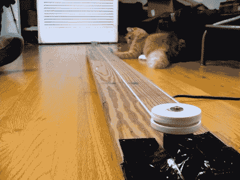

# 给你家猫咪无聊的冬季生活加油

> 原文：<https://hackaday.com/2012/01/02/pep-up-your-house-cats-boring-wintertime-life/>

冬天来了，所有的窗户都关着，[加菲猫]和[袜子]会变得有些焦躁不安。但是[迪诺]决心让他的毛茸茸的朋友们开心度过寒冷黑暗的几个月。他撞上了垃圾箱，并使用一些有趣的制造技术[制造了追逐老鼠的电动猫玩具](http://hackaweek.com/hacks/?p=551)。

这种玩具很受猫的欢迎，因为它结合了两个传统的令人满意的特征；一个要追的东西，一个要追的障碍。这个装置的底座是一块长木板，离地面几英寸高。横跨棋盘长度的绳圈上用大约 6 英寸的绳子系着一只老鼠。当马达打开时，它会在电路中来回跳动，在底座下方的空间里进进出出。

正如你在视频中看到的，休息之后，马达声音有点大。[Dino]用了 Roomba 的扫地机马达。一开始可能会吓到小猫，但好奇心最终会战胜它们。这是一个快速的构建，我们喜欢用来制作系统的木制滑轮的钻车车床。

 <https://www.youtube.com/embed/2q6GtA6j7HE?version=3&rel=1&showsearch=0&showinfo=1&iv_load_policy=1&fs=1&hl=en-US&autohide=2&wmode=transparent>

 </body> </html>