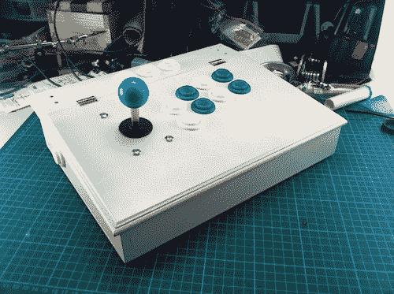

# 街机控制器会让你羡慕按钮

> 原文：<https://hackaday.com/2012/01/03/arcade-controller-will-give-you-button-envy/>

[【亚伦的】街机控制器](http://x2jiggy.com/2012/01/xbox-pc-arcade-joystick/)真的让我们很想下一个按钮订单。在他的设计或制造中没有隐藏任何秘密，但他非常干净利落地完成了组装工作。

外壳是他在五金店买的一个文具盒(但他也展示了一个 emtpy Xbox 360 盒子，上面有相同的控制布局)。它有一个铰链盖，非常适合接触内部组件，在长时间的游戏过程中，它也可以为您的手腕提供一个很好的角度。

Xbox 360 控制器为设备提供连接。显然，它可以与微软的硬件一起工作，但是所有现代的操作系统都有与这些控制器接口的方法。在休息后的视频中，你可以看到[Aaron]切开控制器，将电线焊接到所有的按钮垫上，并将它们连接到一些端子板上。这使得里面的丝组织相当干净。他使用压接连接器将按钮和操纵杆跨接在端子的另一侧。再涂上一层漂亮的油漆，你就有了一个控制器，看起来就像在你家的客厅里一样。

[https://www.youtube.com/embed/L5qrZHVFXE0?version=3&rel=1&showsearch=0&showinfo=1&iv_load_policy=1&fs=1&hl=en-US&autohide=2&wmode=transparent](https://www.youtube.com/embed/L5qrZHVFXE0?version=3&rel=1&showsearch=0&showinfo=1&iv_load_policy=1&fs=1&hl=en-US&autohide=2&wmode=transparent)