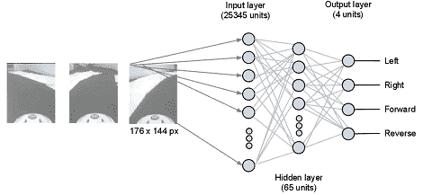

# 神经网络控制玩具车

> 原文：<https://hackaday.com/2012/01/03/nerual-networks-control-a-toy-car/>

去年，在参加了斯坦福大学通过互联网提供的机器学习课程后，[大卫·辛格尔顿]认为他可以做出一些非常酷的东西。我们不得不承认，他用[他的神经网络控制汽车](http://blog.davidsingleton.org/nnrccar)钉死了它。没有太多的建设；只是一个安卓手机，一个 Arduino，一个玩具车。这个版本的机器学习部分真的让它很特别。

神经网络接受一大堆输入，并将它们表示为网络中的一个节点。[Davids]的输入层中的每个节点都对应于从他的手机摄像头中检索到的一个像素。输入层的所有输入都连接到“隐藏层”中的 64 个节点。隐藏层中的节点连接到四个输出节点，即左、右、前、后。

在对网络进行训练并对所有连接进行加权后，[大卫]得到了一辆玩具汽车，可以在赛道上行驶。很奇怪，但是很有效。所有代码都在 [github](https://github.com/dps/nnrccar/blob/master/arduino/serialrccar/serialrccar.pde) 上，所以请随意看看神经网络的内部机制。当然，你可以在休息之后看看[大卫]的车的视频。

编辑:我们最初认为作者是[icebrain]。我们的错，我们希望[大卫]现在不要恨我们。

[https://www.youtube.com/embed/DWNtsS2kZWs?version=3&rel=1&showsearch=0&showinfo=1&iv_load_policy=1&fs=1&hl=en-US&autohide=2&wmode=transparent](https://www.youtube.com/embed/DWNtsS2kZWs?version=3&rel=1&showsearch=0&showinfo=1&iv_load_policy=1&fs=1&hl=en-US&autohide=2&wmode=transparent) [https://www.youtube.com/embed/ndSiW9Zmd6g?version=3&rel=1&showsearch=0&showinfo=1&iv_load_policy=1&fs=1&hl=en-US&autohide=2&wmode=transparent](https://www.youtube.com/embed/ndSiW9Zmd6g?version=3&rel=1&showsearch=0&showinfo=1&iv_load_policy=1&fs=1&hl=en-US&autohide=2&wmode=transparent)