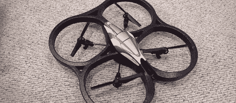

# 使用四轴飞行器轻松跟踪摄像机

> 原文：<https://hackaday.com/2012/01/04/easy-camera-tracking-with-a-quadrocopter/>

[DJ Sures]最近一直在通宵工作，以使他的 AR 无人驾驶鹦鹉建造离开地面。现在它已经飞了起来，他设法让它使用机载摄像机跟踪房间里的物体。

为了建造，[DJ Sures]使用了 [AR 无人机](http://ardrone.parrotshopping.com/us/p_ardrone_main.aspx)‘飞行视频游戏’Quadro copter。这个玩具有两个机载摄像头，可以通过 wifi 观看。所有需要的是一些有趣的软件，使事情变得有趣。EZ-Builder 软件的相机跟踪功能被融入其中，因此可以通过对象或语音识别、wiimotes、平板电脑或终端来控制 AR 无人机。

[DJ Sures]已经想出了一些稍微有点可怕的令人敬畏的构建，如[蓝牙泰迪熊](http://hackaday.com/2011/02/18/hacking-teddy-ruxpin/)、[现实瓦力](http://hackaday.com/2011/07/22/modded-wall-e-becomes-a-real-robot/)和令人敬畏的[omni bot 2000](http://hackaday.com/2011/12/08/dj-sures-digs-up-another-80s-robot-toy-makes-it-awesome/)refurb。这是他的第一次飞行黑客，也是第一次完全利用 EZ-Builder 软件的相机跟踪。休息之后，看看[Sures]的直升机跟着他在一个房间里转。

 <https://www.youtube.com/embed/ljlRxka_eBY?version=3&rel=1&showsearch=0&showinfo=1&iv_load_policy=1&fs=1&hl=en-US&autohide=2&wmode=transparent>

 </body> </html>