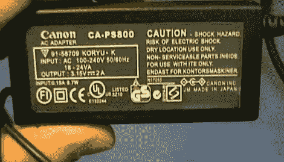

# 揭露一些价格高得令人难以置信的假冒电子产品

> 原文：<https://hackaday.com/2012/01/04/exposing-some-fake-electronics-with-too-good-to-be-true-prices/>

[Giorgos Lazaridis]的佳能 PowerShot 相机需要一个交流适配器。他找到了易贝，很兴奋地发现这个品牌适配器只需五美元！它工作正常，尽管有时如果电线缠绕在插孔上，它会重新启动他的相机，但他对它做了它应该做的事情感到满意。

也就是说，直到有一天，他在拍摄他正在制作原型的 PIC 电路时，观察到一些非常奇怪的行为。当他拿着相机，把另一只手放在试验板附近时，他电路中的一个状态 led 开始偶尔闪烁。如果他用的是电池而不是适配器，这种情况就不会发生。

他的第一反应是将适配器连接到示波器上，看看电源总线上发生了什么。信号非常嘈杂。令人震惊的是。[Giorgos] [撬开机箱，看看里面的电源](http://www.pcbheaven.com/userpages/how_cheap_is_a_power_supply/)电路是怎么回事。你只需在休息后观看视频，就能看到他发现的恐怖秀。电路板焊接不良，元件没有正确放置在它们的足迹中，我们最喜欢的是[Giorgos]指出一条弯曲的轨迹来代替平滑电感。

您是否记录了自己发现的假冒电子硬件？我们很想听听他们的故事。T3

<https://www.youtube.com/embed/DZDh8z9UDTo?version=3&rel=1&showsearch=0&showinfo=1&iv_load_policy=1&fs=1&hl=en-US&autohide=2&wmode=transparent>

 </body> </html>