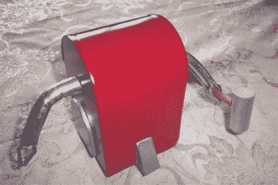

# Line-follower 是对[荷马]的敬意；侵犯版权的计划

> 原文：<https://hackaday.com/2012/01/04/line-follower-is-an-homage-to-homer-plans-to-infringe-copyrights/>

首席本垒打机器人是《辛普森一家》中的*。*机器人设计出现在【荷马】给【巴特】造了一个战斗机器人的一集里。因为他不是机器人制造者，所以[Homer]实际上爬进了壳里，在遭受严重伤害的同时进行了甜蜜的报复。

但是,[心理]有必要的技能来使它自主，同时保持它看起来就像电视节目一样。他的一个朋友有一台数控铣床，用它从 Masonite 上切割出外壳零件，然后用热胶水组装起来。一对小型伺服系统驱动底座后部的两个轮子，一个滚珠轴承万向轮位于前部中央。还有两个向下指向的传感器，让它能够在休息后跟随视频中看到的一条线。

我们喜欢油漆工作，它真的擦亮了外观。但是[Pyscho]还没有完全完成。他计划添加一个音频电路，让机器人能够播放经典的声音片段。

 <https://www.youtube.com/embed/JxpWm1aIkQw?version=3&rel=1&showsearch=0&showinfo=1&iv_load_policy=1&fs=1&hl=en-US&autohide=2&wmode=transparent>

 
[谢谢蒂姆]
 </body> </html>